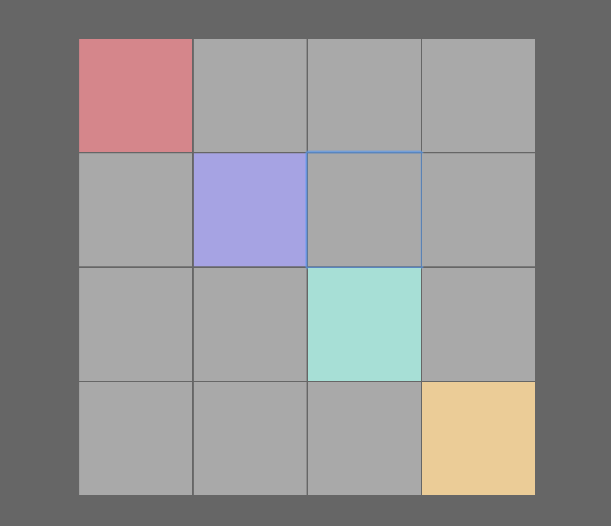

<h2 align="center">Music box created with React/GraphQL</h2>

 
  

  
   
   
   
  

Lyre - is the mentoring project created to inspire you to play some music, learn Apollo and GraphQL. Look on this [medium](https://medium.com/@rumata/gymnasion-mentor-academy-on-github-80a3b939653b) post about gymnasion mentor academy.

  

  <a href="http://lyre.gymnasion.io">Live Demo</a>

## Overview

### Featuring Technologies
- Create react app - (Scaffold)
- React - (UI Framework)
- GraphQL(GraphCool) - (Web Data API)
- Apollo - (GraphQL Client)
- Webpack - (Build tool)
- Redux - (State Management)
- Node.js(Heroku) - (Web Server)
- Express - (Web App Server)
- Babel - (JS Transpiling)
- ESLint - (JS Best Practices/Code Highlighting)
- Jest - (Tests)

### Architectural Benefits 

**Front End**
- Declarative UI - (react)
- Functional State Management - (redux)
- GraphQL Fragment Colocation - (react-apollo)

**Server**
- Universal JS - (node & express)
- Declarative GraphQL Schema - (react-tools)
- Use GraphCool as a service for hosting GraphQL
- Hosted in Heroku

**Dev/Test**
- Hot Module Reloading - (webpack)
- Snapshot Testing - (jest)
- Package Install - (npm v.5)
- JS Best Practices - (eslint)

## How To Start

### One Click Download & Run

You can download and run the repo with one command to rule them all:

`git clone https://github.com/gymnasion/lyre.git && cd lyre && npm install && npm start`

### Setup

Running the app in dev mode is fully featured including *hot module reloading*:

`npm install`

`npm start`

To run in production mode:

`npm run build && npm start`

### Configuration

The project has zero configuration thanks to Create react app.

## How To Test

### Jest

`npm test`

This project uses Jest and can do snapshot testing of React components. Whenever a component is changed, please update the snapshots using `npm test -- -u` or `jest --updateSnapshot`.
## Contributing
Pull requests are welcome. File an issue for ideas, conversation or feedback.

### Community
After you ★Star this project, join us [@gymnasion](https:///github.com/gymnasion) on Github. We are looking for more attendees, mentors and ideas.
Thanks to [@FanQueen](https:///github.com/fanqueen), [@barsukov](https:///github.com/barsukov) for participating